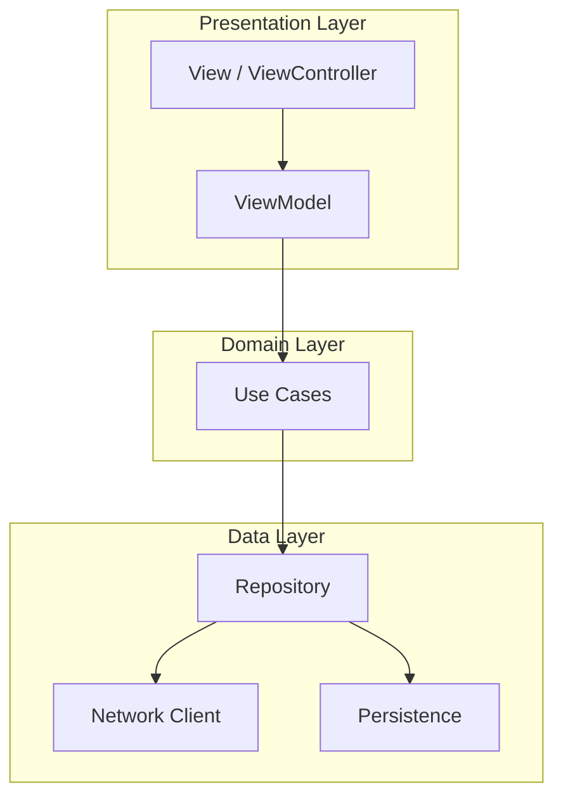

# MungCourse iOS 클라이언트 아키텍처 설계

## 1. 개요
- 문서 목적: 전체 시스템 구조와 모듈 간 관계를 정의하여 구현 및 확장 가이드를 제공  
- 범위: iOS 앱(UIKit/SwiftUI 기반) 클라이언트의 주요 레이어 및 컴포넌트

## 2. 요구사항 및 품질 속성
### 기능 요구사항
- 코스 목록 조회/검색  
- 강의 재생 및 진행 상태 추적  
- 사용자 인증 및 프로필 관리  
- 오프라인 학습 지원  

### 비기능 요구사항
- 확장성: 신규 기능 추가 시 최소한의 영향  
- 유지보수성: 모듈화, 낮은 결합도  
- 안정성: 비동기 처리 및 에러 방어  
- 성능: 표시 화면 지연 최소화  

## 3. 주요 설계 패턴
- MVVM(Model-View-ViewModel) + Coordinator(네비게이션 관리)  
- Repository 패턴(데이터 추상화)  
- Dependency Injection(Swift Package Manager 또는 Resolver)

## 4. 레이어 구조

## 5. 컴포넌트 설명
- Presentation Layer  
  - View: SwiftUI View 또는 UIViewController  
  - ViewModel: 상태 관리, 사용자 입력 처리  
- Domain Layer  
  - Use Case: 핵심 비즈니스 로직  
- Data Layer  
  - Repository: API(Client)와 DB(CoreData/Realm) 중개  
  - Network Client: URLSession 혹은 Alamofire 래퍼  
  - Persistence: CoreData 또는 Realm

## 6. 네비게이션 관리
- Coordinator 패턴  
  - AppCoordinator: 앱 초기 흐름  
  - CourseCoordinator: 코스 관련 화면 전환  
  - AuthCoordinator: 로그인/회원가입 흐름

## 7. 에러 처리 및 로깅
- 에러 타입 정의(AppError enum)  
- 사용자 친화적 메시지 매핑  
- Sentry / Firebase Crashlytics 연동

## 8. 의존성 관리
- Swift Package Manager: 내부 모듈 및 외부 라이브러리 관리  
- CocoaPods(선택): 필요한 경우

## 9. 테스트 전략
- Unit Test: ViewModel, Use Case, Repository  
- UI Test: 주요 사용자 흐름  
- Mocking: 네트워크, DB 레이어 분리

## 10. CI/CD 파이프라인
- GitHub Actions: 빌드, 테스트, 린트  
- Fastlane: TestFlight 배포, App Store Release

## 11. 확장 및 유지보수 고려사항
- Feature Module별 독립 레포지토리 또는 서브디렉터리 구조  
- Cross-cutting Concern 분리(로깅, 인증, 설정)

---
본 문서를 바탕으로 세부 설계(API 명세, 데이터 모델링, UI 와이어프레임)를 추가로 진행합니다.
